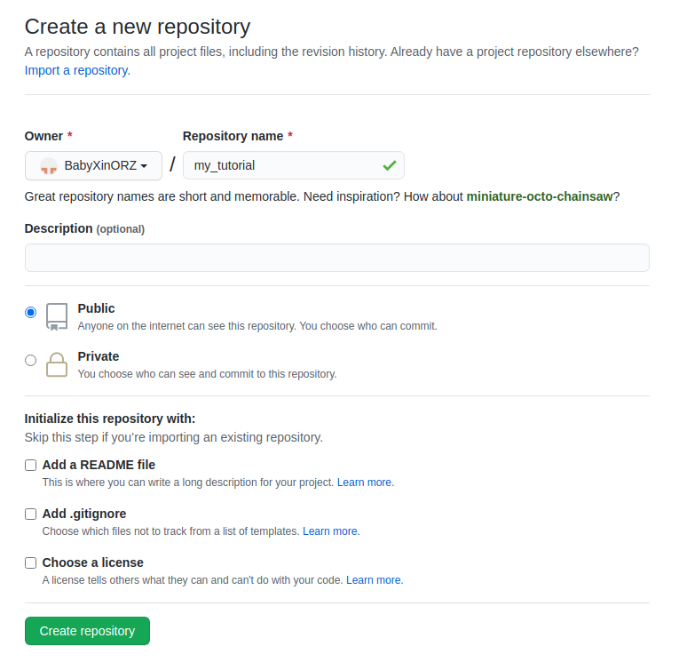

# git

## git基础入门

参考文章: 1. [Git教程 \| 菜鸟教程](https://www.runoob.com/git/git-tutorial.html) 2. [Git五分钟教程 \| 菜鸟教程](https://www.runoob.com/w3cnote/git-five-minutes-tutorial.html)

## Introduction

> Git is a free and open source distributed version control system designed to handle everything from small to very large projects with speed and efficiency.
>
> -[https://git-scm.com/](https://git-scm.com/)

Git 是一个开源的分布式版本控制系统，用于敏捷高效地处理任何或小或大的项目。

Git是**Linus Torvalds** \(linux系统创始者\)为了帮助管理 Linux 内核开发而开发的一个开放源码的版本控制软件。

用我的话说, git就是一个用于上传/下载代码, 多分支管理的命令行工具.

## Git wrok flow


来自\[Git 工作流程\|菜鸟教程\]\(https://www.runoob.com/git/git-workflow.html\)

## Git server

现在主流的Git服务器有[github](http://www.github.com),[gitlab](http://gitlab.artinx.icu),[gitee](http://gitee.com)

这次我们主要学习[github](http://www.github.com)的使用.

### create an account

邮箱尽量用qq邮箱吧,学校邮箱可能有问题.

### create an repository

按照下图的选择新建项目



### submit a piece of code

在一个合适的路径下打开命令行,运行以下命令:

```text
echo "# my_tutorial" >> README.md
git init
git add README.md
git commit -m "first commit"
git branch -M master
git remote add origin git@github.com:BabyXinORZ/my_tutorial.git
git push -u origin master
```

### Code Part

在Repository的Code中,可以自由查看项目中的文件.当打开一个新的文件夹时,会默认渲染文件夹下的`Readme.md`文件.

### Branch

以[OpenCV](https://github.com/opencv/opencv)为例, 左上角有一个分支切换的下拉菜单,可以自由切换分支. \(可见OpenCV的版本有master/2.4/3.4\)

分支可以理解为版本,当需要实现新的功能/修补一个BUG而不想影响现有的代码时,可以新建分支来实现.

同时项目的管理者可以自由切换默认分支.\(一般默认分支是master\)

### Release

发行版\(Release\)的位置在Code目录的右侧.Release里面包含了这个项目的从旧到新的所有版本,还包括测试版. 里面一般有编译好的二进制文件或者安装包文件,可以直接使用.

### Issue

在Issue中,可以发布任务,提出BUG,提出需求.同时,当使用其他项目遇到不会解决的问题时,可以在issue中寻找类似情况或者自行提交issue.

### General work flow

一般工作时,我们的工作流程主要是:

新建项目测试demo-&gt;根据demo数据需求定制接口并提交到issue-&gt;新建分支,上传修改代码-&gt;合并分支至主分支

## Common commands

#### `git init`

**功能:** 创建新的 git 仓库。会在你的执行目录下新建一个`.git`文件夹.\(使用命令`ls -a`可以查看到\)

**使用场景:** 当你想要上传已有的代码至一个新的`repository`时, 需要使用此命令.

#### `git config`

**功能:** 配置一些文件

**使用场景:** 当你想要调整一些库的配置时,需要使用此命令.

**使用范例**

```text
git config user.name --global "BabyXin"
# 将git的用户名设置为"BabyXin"
git config user.email --global "1635639396@qq.com"
# 将git的邮箱设置为"1635639396@qq.com"
```

以上两个命令是用于全局配置上传代码的用户信息,这两个命令对于一个电脑来说**仅需要配置一次**.如果是有多个用户用一台电脑,则不能使用`--global`词条,在每个项目中都需要配置对应的帐号与邮箱.

以下词条结合[工作流内容](git.md#general-work-flow)进行理解.可以参考[git-简明指南](https://www.runoob.com/manual/git-guide/)

#### `git clone`\(Compulsory\)

#### `git add`\(Compulsory\)

#### `git commit`\(Compulsory\)

#### `git push`\(Compulsory\)

#### `git remote`\(Compulsory\)

#### `git branch`\(Optional\)

#### `git checkout`\(Optional\)

## Special files in repo

repo中常见的有以下三种特殊文件,分别有不同的功能

### Readme.md\(Compulsory\)

可以理解为使用必读/说明书.用来解释当前文件夹下的一些东西.

打开github/gitlab/gitee的源代码的某个文件夹,会自动渲染显示那个文件夹下的`Readme.md`文件

### .gitignroe\(Compulsory\)

`.gitignore`可以拆解为`.git`和`ignore`两个部分,这个文件是用来告诉git上传时忽略哪些文件的.

因为前面有一个`.`符号,所以这种文件在文件夹里是默认不显示的.

.gitignore相关规则可以参考[Git Ignore基本用法](https://github.com/onlynight/ReadmeDemo/tree/master/Readmes/GitIgnore) 以及[A collection of .gitignore templates](https://github.com/github/gitignore)

### Licence\(Optional\)

知道有这个东西即可,不需要过多深入

[Licences on github](https://docs.github.com/en/free-pro-team@latest/rest/reference/licenses) [Github上如何添加 LICENSE 文件？](https://www.cnblogs.com/chenmingjun/p/8555906.html)

## VSCode and Git\(Compulsory\)

修改代码-&gt;加号添加修改的文件-&gt;输入commmet-&gt;点击☑️commit-&gt;点击左下角切换分支-&gt;上传代码

## SSH Key

使用SSH凭据可以无需密码进行一些git操作,参考链接:[ubuntu 安装Git与配置SSH key](https://blog.csdn.net/yunna520/article/details/83346207)

